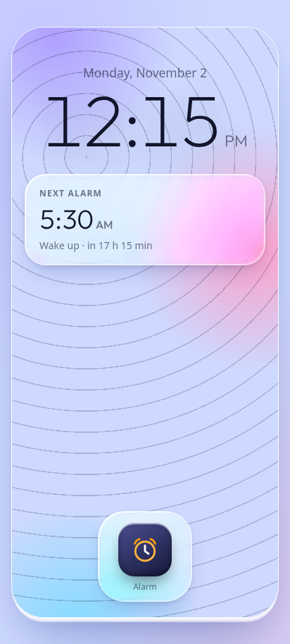
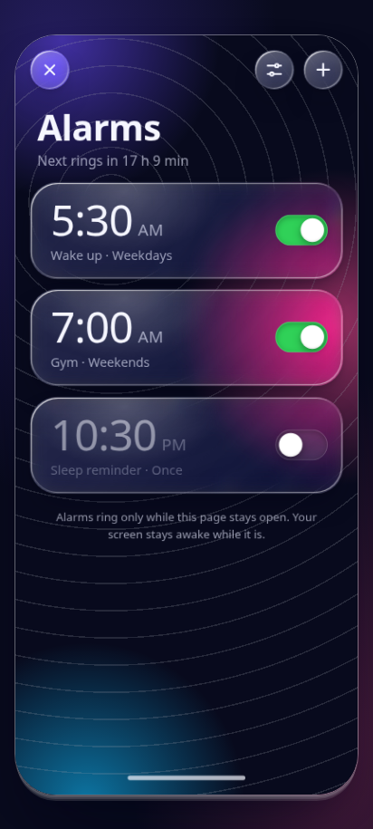
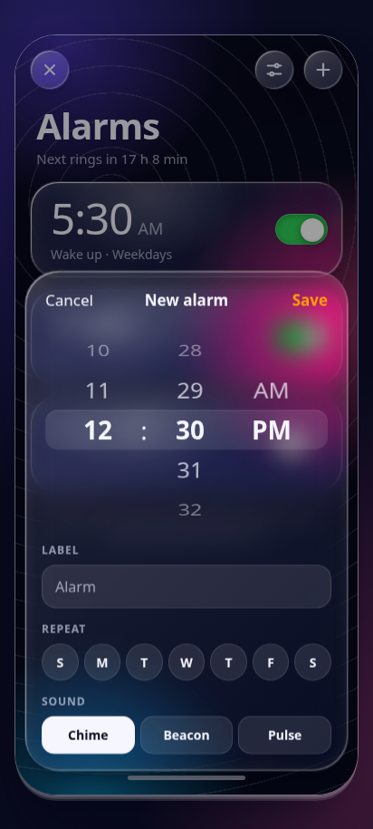

# Glass Alarm — Android APK

## ☕ Donate / Buy me a coffee

**Coming soon** — our donation options are on the way.

| Platform | Status |
| --- | --- |
| Paytm | Coming soon |
| PayPal | Coming soon |
| GPay (Google Pay) | Coming soon |

If you like our work, you can support us with a donation. We are bringing this very soon — **coming soon**.

---

## 🌐 Donate / Buy me a coffee — all languages

**Coming soon** · Paytm · PayPal · GPay — all coming soon.

**🇮🇳 Indian languages**

- **Hindi** (हिन्दी): ☕ Donate / Buy me a coffee — जल्द ही आ रहा है। Paytm, PayPal और GPay जल्द ही आ रहे हैं। अगर आपको हमारा काम पसंद है, तो आप डोनेशन देकर हमारा सपोर्ट कर सकते हैं। हम इसे बहुत जल्द ला रहे हैं।
- **Bengali** (বাংলা): ☕ Donate / Buy me a coffee — খুব শিগগিরই আসছে। Paytm, PayPal এবং GPay খুব শিগগিরই আসছে। আমাদের কাজ ভালো লাগলে, আপনি অনুদান দিয়ে আমাদের পাশে দাঁড়াতে পারেন। আমরা খুব তাড়াতাড়ি এটা নিয়ে আসছি।
- **Marathi** (मराठी): ☕ मला कॉफी दान करा / माझ्यासाठी कॉफी विकत घ्या — लवकरच येत आहे. Paytm, PayPal आणि GPay लवकरच येत आहेत. जर तुम्हाला आमचं काम आवडत असेल, तर तुम्ही आम्हाला देणगी देऊन सपोर्ट करू शकता. आम्ही हे लवकरच सुरू करत आहोत.
- **Telugu** (తెలుగు): ☕ నాకు కాఫీ కొనివ్వండి / విరాళం ఇవ్వండి — త్వరలో రాబోతోంది. Paytm, PayPal మరియు GPay త్వరలో రాబోతున్నాయి. మా పని మీకు నచ్చితే, మీరు విరాళం ఇవ్వడం ద్వారా మాకు మద్దతు ఇవ్వవచ్చు. దీన్ని మేము త్వరలోనే తీసుకువస్తున్నాము.
- **Tamil** (தமிழ்): ☕ எனக்கு ஒரு காபி வாங்கிக் கொடுங்கள் / நன்கொடை — விரைவில் வருகிறது. Paytm, PayPal மற்றும் GPay விரைவில் வரவுள்ளன. எங்களுடைய வேலை உங்களுக்குப் பிடித்திருந்தால், நன்கொடை அளித்து நீங்கள் எங்களுக்கு ஆதரவளிக்கலாம். இதை நாங்கள் விரைவில் கொண்டு வருகிறோம்.
- **Gujarati** (ગુજરાતી): ☕ મને કોફી દાન કરો / કોફી ખરીદો — ટૂંક સમયમાં આવી રહ્યું છે. Paytm, PayPal અને GPay ટૂંક સમયમાં આવી રહ્યા છે. જો તમને અમારું કામ ગમે, તો તમે અમને દાન આપીને સપોર્ટ કરી શકો છો. અમે તેને બહુ જલ્દી લાવી રહ્યા છીએ.
- **Kannada** (ಕನ್ನಡ): ☕ ಡೊನೇಟ್ / ನನಗೆ ಒಂದು ಕಾಫಿ ಕೊಡಿಸಿ — ಶೀಘ್ರದಲ್ಲೇ ಬರುತ್ತಿದೆ. Paytm, PayPal ಮತ್ತು GPay ಶೀಘ್ರದಲ್ಲೇ ಬರಲಿವೆ. ನಿಮಗೆ ನಮ್ಮ ಕೆಲಸ ಇಷ್ಟವಾದರೆ, ನೀವು ದೇಣಿಗೆ ನೀಡುವ ಮೂಲಕ ನಮಗೆ ಬೆಂಬಲ ನೀಡಬಹುದು. ನಾವು ಇದನ್ನು ಬಹಳ ಶೀಘ್ರದಲ್ಲೇ ತರುತ್ತಿದ್ದೇವೆ.
- **Malayalam** (മലയാളം): ☕ Donate / Buy me a coffee — ഉടൻ വരുന്നു. Paytm, PayPal, GPay എന്നിവ ഉടൻ വരുന്നു. ഞങ്ങളുടെ വർക്കുകൾ നിങ്ങൾക്ക് ഇഷ്ടമാണെങ്കിൽ, ഒരു സംഭാവന നൽകി ഞങ്ങളെ പിന്തുണയ്ക്കാം. ഞങ്ങൾ ഇത് വളരെ വേഗം കൊണ്ടുവരുന്നുണ്ട്.
- **Odia** (ଓଡ଼ିଆ): ☕ ମୋତେ କଫି କିଣି ଦିଅନ୍ତୁ / ଡୋନେଟ୍ କରନ୍ତୁ — ଖୁବ୍ ଶୀଘ୍ର ଆସୁଛି। Paytm, PayPal ଏବଂ GPay ଖୁବ୍ ଶୀଘ୍ର ଆସୁଛି। ଯଦି ଆପଣଙ୍କୁ ଆମ କାମ ପସନ୍ଦ, ତେବେ ଆପଣ ଆମକୁ ଡୋନେସନ୍ ଦେଇ ସପୋର୍ଟ କରିପାରିବେ। ଆମେ ଏହାକୁ ଖୁବ୍ ଶୀଘ୍ର ଆଣିବୁ।
- **Punjabi** (ਪੰਜਾਬੀ): ☕ ਮੈਨੂੰ ਕੌਫੀ ਦਾਨ ਕਰੋ / ਮੇਰੇ ਲਈ ਕੌਫੀ ਖਰੀਦੋ — ਜਲਦੀ ਆ ਰਿਹਾ ਹੈ। Paytm, PayPal ਅਤੇ GPay ਜਲਦੀ ਆ ਰਹੇ ਹਨ। ਜੇਕਰ ਤੁਹਾਨੂੰ ਸਾਡਾ ਕੰਮ ਪਸੰਦ ਹੈ, ਤਾਂ ਤੁਸੀਂ ਦਾਨ ਦੇ ਕੇ ਸਾਡਾ ਸਾਥ ਦੇ ਸਕਦੇ ਹੋ। ਅਸੀਂ ਇਸਨੂੰ ਬਹੁਤ ਜਲਦੀ ਲੈ ਕੇ ਆ ਰਹੇ ਹਾਂ।
- **Assamese** (অসমীয়া): ☕ Donate / Buy me a coffee — অতি সোনকালেই আহি আছে। Paytm, PayPal আৰু GPay অতি সোনকালেই আহি আছে। যদি আপুনি আমাৰ কাম ভাল পায়, তেন্তে আপুনি দান কৰি আমাক সহায় কৰিব পাৰে। আমি এইটো অতি সোনকালেই লৈ আহি আছোঁ।
- **Urdu** (اردو): ☕ مجھے کافی ڈونیٹ / خریدیں — جلد آرہا ہے۔ Paytm، PayPal اور GPay جلد آرہے ہیں۔ اگر آپ کو ہمارا کام پسند ہے، تو آپ ڈونیشن دے کر ہماری مدد کر سکتے ہیں۔ ہم اسے بہت جلد لا رہے ہیں۔
- **Nepali** (नेपाली): ☕ मलाई कफी किनिदिनुहोस् / दान गर्नुहोस् — छिट्टै आउँदैछ। Paytm, PayPal र GPay पनि छिट्टै आउँदैछन्। यदि तपाईंलाई हाम्रो काम मन पर्छ भने, तपाईंले हामीलाई दान गरेर सहयोग गर्न सक्नुहुन्छ। हामी यो सुविधा धेरै चाँडै ल्याउँदैछौं।
- **Sanskrit** (संस्कृतम्): ☕ मह्यं काफीं क्रीणन्तु / दानं कुर्वन्तु — शीघ्रमेव आगच्छति। Paytm, PayPal तथा GPay अपि शीघ्रमेव आगच्छन्ति। यदि भवन्तः अस्माकं कार्यं रोचन्ते, तर्हि दानं कृत्वा अस्मान् समर्थयितुं शक्नुवन्ति। वयं तत् शीघ्रमेव आनयामः।
- **Konkani** (कोंकणी): ☕ म्हाका कॉफी दान करात / म्हजे खातीर कॉफी घेयात — रोखडेंच येता. Paytm, PayPal आनी GPay रोखडेंच येतले. तुमकां आमचें काम आवडल्यार, तुमी आमकां देणगी दिवन आदार करूंक शकतात. आमी तें खूब बेगीन हाडटात.
- **Maithili** (मैथिली): ☕ हमरा लेल कॉफी डोनेट करू / खरीदू — जल्दिये आबि रहल अछि। Paytm, PayPal आ GPay जल्दिये आबि रहल अछि। जँ अहाँकेँ हमर काज नीक लागैत अछि, तँ अहाँ दान कऽ कऽ हमर समर्थन कऽ सकैत छी। हम एकरा बहुत जल्दी लाबि रहल छी।
- **Kashmiri** (کٲشُر): ☕ مےٚ دِیِو اَکھ کافی — جَلدی یِوان چھُ۔ Paytm, PayPal تہٕ GPay چھِ جَلدی یِوان۔ اَگر تُہؠ سٲنؠ کٲم پَسَند چھِو کَران، تُہؠ ہیٚکِو اَسے اَکھ ڈونیشَن دِتھ سَپورٹ کٔرِتھ۔ اَسؠ چھِ یہِ واریاہ جَلدی اَنان۔
- **Sindhi** (سنڌي): ☕ डोनेट / मूंखे हिक कॉफी वठायो — जल्द अची रह्यो आहे। Paytm, PayPal ऐं GPay जल्द अची रह्या आहिन। जेकडहिं तव्हां खे असां जो कमु वणंदो आहे, त तव्हां असां खे डोनेशन डई सपोर्ट करे सघो था। असीं इहो डाढो जल्द आणी रह्या आहियूं।
- **Dogri** (डोगरी): ☕ डोनेट / मेरे लेई इक कॉफी खरीदो — जल्दी आ करदा ऐ। Paytm, PayPal ते GPay जल्दी आ करदे न। जेकर तुसेंगी साढ़ा कम्म पसंद ऐ, तां तुस साढ़ी मदद दान देइयै करी सकदे ओ। अस इसगी बड़ा जल्दी लेई आ करदे आं।
- **Manipuri** (ꯃꯤꯇꯩ ꯂꯣꯟ): ☕ ꯗꯣꯅꯦꯠ / ꯑꯩꯉꯣꯟꯗꯥ ꯀꯣꯐꯤ ꯑꯃꯥ ꯂꯩꯕꯤꯔꯛꯎ — ꯑꯊꯨꯕꯥ ꯃꯇꯝꯗꯥ ꯂꯥꯛꯀꯅꯤ꯫ Paytm, PayPal ꯑꯃꯁꯨꯡ GPay ꯑꯊꯨꯕꯥ ꯃꯇꯝꯗꯥ ꯂꯥꯛꯀꯅꯤ꯫ ꯀꯔꯤꯒꯨꯝꯕꯥ ꯅꯈꯣꯌꯅꯥ ꯑꯩꯈꯣꯌꯒꯤ ꯊꯕꯛ ꯑꯁꯤ ꯄꯥꯝꯂꯕꯗꯤ, ꯅꯈꯣꯌꯅꯥ ꯗꯣꯅꯦꯁꯟ ꯑꯃꯒꯥ ꯂꯣꯌꯅꯅꯥ ꯑꯩꯈꯣꯌꯕꯨ ꯃꯇꯦꯡ ꯄꯥꯡꯕꯤꯕꯥ ꯌꯥꯏ꯫ ꯑꯩꯈꯣꯌꯅꯥ ꯃꯁꯤ ꯑꯊꯨꯕꯥ ꯃꯇꯝꯗꯥ ꯄꯨꯔꯛꯂꯤ꯫
- **Bodo** (बर’): ☕ आंनो कफि बायना हो — थाबैनो फैगोन। Paytm, PayPal आरो GPay आ थाबैनो फैगोन। जुदि नोंथांमोना जोंनि हाबाखौ मोजां मोनो, नोंथांमोना जोंखौ दान होनानै मदद खालामनो हागोन। जों बेखौ थाबैनो लाबोगोन।
- **Santali** (ᱥᱟᱱᱛᱟᱲᱤ): ☕ ᱫᱟᱱ / ᱤᱧ ᱢᱤᱫ ᱠᱚᱯᱷᱤ ᱠᱤᱨᱤᱧ ᱤᱧ — ᱞᱚᱜᱚᱱ ᱦᱤᱡᱩᱜ ᱠᱟᱱᱟ᱾ Paytm, PayPal ᱟᱨ GPay ᱞᱚᱜᱚᱱ ᱦᱤᱡᱩᱜ ᱠᱟᱱᱟ᱾ ᱡᱩᱫᱤ ᱟᱞᱮᱭᱟᱜ ᱠᱟᱹᱢᱤ ᱯᱮ ᱠᱩᱥᱤᱭᱟᱜ ᱠᱟᱱᱟ, ᱮᱱᱠᱷᱟᱱ ᱫᱟᱱ ᱠᱟᱛᱮ ᱟᱞᱮ ᱜᱚᱲᱚ ᱫᱟᱲᱮᱭᱟᱯᱮᱭᱟ ᱯᱮ᱾ ᱟᱞᱮ ᱱᱚᱶᱟ ᱟᱹᱰᱤ ᱞᱚᱜᱚᱱ ᱞᱮ ᱟᱹᱜᱩᱭᱮᱫᱟ᱾

**🌍 Global languages**

- **Spanish** (Español): ☕ Donar / Invítame un café — Muy pronto. Paytm, PayPal y GPay estarán disponibles muy pronto. Si te gusta nuestro trabajo, puedes apoyarnos con una donación. Lo estamos lanzando muy pronto.
- **French** (Français): ☕ Faire un don / Offrez-moi un café — Bientôt disponible. Paytm, PayPal et GPay arrivent très bientôt. Si vous aimez notre travail, vous pouvez nous soutenir avec un don. Nous le mettons en place très bientôt.
- **German** (Deutsch): ☕ Spenden / Spendier mir einen Kaffee — Bald verfügbar. Paytm, PayPal und GPay kommen sehr bald. Wenn dir unsere Arbeit gefällt, kannst du uns mit einer Spende unterstützen. Wir bringen es sehr bald.
- **Portuguese** (Português): ☕ Doar / Pague-me um café — Em breve. Paytm, PayPal e GPay chegam em breve. Se você gosta do nosso trabalho, pode nos apoiar com uma doação. Estamos trazendo isso muito em breve.
- **Italian** (Italiano): ☕ Dona / Offrimi un caffè — In arrivo. Paytm, PayPal e GPay arrivano presto. Se ti piace il nostro lavoro, puoi sostenerci con una donazione. Lo stiamo lanciando molto presto.
- **Dutch** (Nederlands): ☕ Doneer / Trakteer me op een koffie — Binnenkort beschikbaar. Paytm, PayPal en GPay komen binnenkort. Als je ons werk leuk vindt, kun je ons steunen met een donatie. We brengen dit heel binnenkort.
- **Polish** (Polski): ☕ Przekaż datek / Postaw mi kawę — Wkrótce. Paytm, PayPal i GPay już wkrótce. Jeśli podoba Ci się nasza praca, możesz nas wesprzeć datkiem. Wprowadzamy to bardzo szybko.
- **Russian** (Русский): ☕ Пожертвовать / Купи мне кофе — Скоро. Paytm, PayPal и GPay появятся совсем скоро. Если вам нравится наша работа, вы можете поддержать нас пожертвованием. Мы запускаем это очень скоро.
- **Ukrainian** (Українська): ☕ Пожертвувати / Купи мені каву — Незабаром. Paytm, PayPal і GPay з'являться дуже скоро. Якщо вам подобається наша робота, ви можете підтримати нас пожертвою. Ми запускаємо це дуже скоро.
- **Turkish** (Türkçe): ☕ Bağış yap / Bana bir kahve ısmarla — Çok yakında. Paytm, PayPal ve GPay çok yakında geliyor. İşimizi beğendiyseniz bağışla bizi destekleyebilirsiniz. Çok yakında sunuyoruz.
- **Arabic** (العربية): ☕ تبرّع / اشترِ لي قهوة — قريبًا. Paytm وPayPal وGPay ستتوفر قريبًا جدًا. إذا أعجبك عملنا، يمكنك دعمنا بالتبرع. نطرحه قريبًا جدًا.
- **Persian** (فارسی): ☕ کمک مالی / برایم یک قهوه بخر — به‌زودی. Paytm، PayPal و GPay به‌زودی اضافه می‌شوند. اگر کار ما را دوست دارید، می‌توانید با یک کمک مالی از ما حمایت کنید. این قابلیت را خیلی زود اضافه می‌کنیم.
- **Hebrew** (עברית): ☕ תרומה / קנו לי קפה — בקרוב. Paytm, PayPal ו-GPay יגיעו בקרוב מאוד. אם אתם אוהבים את העבודה שלנו, תוכלו לתמוך בנו בתרומה. אנחנו מביאים את זה בקרוב מאוד.
- **Indonesian** (Bahasa Indonesia): ☕ Donasi / Traktir saya kopi — Segera hadir. Paytm, PayPal, dan GPay segera hadir. Jika Anda menyukai karya kami, Anda dapat mendukung kami dengan donasi. Kami akan menghadirkannya segera.
- **Malay** (Bahasa Melayu): ☕ Derma / Belanja saya kopi — Akan datang. Paytm, PayPal dan GPay akan datang tidak lama lagi. Jika anda suka hasil kerja kami, anda boleh menyokong kami dengan derma. Kami akan membawanya tidak lama lagi.
- **Vietnamese** (Tiếng Việt): ☕ Quyên góp / Mời tôi một ly cà phê — Sắp ra mắt. Paytm, PayPal và GPay sẽ sớm ra mắt. Nếu bạn thích công việc của chúng tôi, bạn có thể ủng hộ bằng một khoản quyên góp. Chúng tôi sẽ sớm mang tính năng này đến.
- **Thai** (ไทย): ☕ บริจาค / เลี้ยงกาแฟฉันสักแก้ว — เร็ว ๆ นี้ Paytm, PayPal และ GPay กำลังจะมาเร็ว ๆ นี้ หากคุณชอบผลงานของเรา คุณสามารถสนับสนุนเราด้วยการบริจาค เรากำลังจะเปิดให้ใช้เร็ว ๆ นี้
- **Japanese** (日本語): ☕ 寄付 / コーヒーをおごる — 近日公開。Paytm、PayPal、GPay も近日対応予定です。私たちの仕事を気に入っていただけたら、寄付で支援できます。まもなく公開します。
- **Korean** (한국어): ☕ 후원 / 커피 한 잔 사주기 — 곧 공개됩니다. Paytm, PayPal, GPay도 곧 지원됩니다. 저희 작업이 마음에 드신다면 후원으로 지원하실 수 있습니다. 곧 선보이겠습니다.
- **Chinese (Simplified)** (简体中文): ☕ 捐赠 / 请我喝杯咖啡 — 即将推出。Paytm、PayPal 和 GPay 即将上线。如果你喜欢我们的作品，可以通过捐赠支持我们。我们很快就会推出。
- **Chinese (Traditional)** (繁體中文): ☕ 捐贈 / 請我喝杯咖啡 — 即將推出。Paytm、PayPal 和 GPay 即將上線。如果你喜歡我們的作品，可以透過捐贈支持我們。我們很快就會推出。
- **Greek** (Ελληνικά): ☕ Δωρεά / Κέρασέ με έναν καφέ — Έρχεται σύντομα. Paytm, PayPal και GPay έρχονται σύντομα. Αν σας αρέσει η δουλειά μας, μπορείτε να μας στηρίξετε με μια δωρεά. Το φέρνουμε πολύ σύντομα.
- **Czech** (Čeština): ☕ Darovat / Kup mi kávu — Již brzy. Paytm, PayPal a GPay budou brzy k dispozici. Pokud se vám naše práce líbí, můžete nás podpořit darem. Přinášíme to velmi brzy.
- **Romanian** (Română): ☕ Donează / Cumpără-mi o cafea — În curând. Paytm, PayPal și GPay vor fi disponibile în curând. Dacă îți place munca noastră, ne poți susține cu o donație. O aducem foarte curând.
- **Hungarian** (Magyar): ☕ Adományozás / Hívj meg egy kávéra — Hamarosan. A Paytm, a PayPal és a GPay hamarosan elérhető. Ha tetszik a munkánk, adománnyal támogathatsz minket. Nagyon hamarosan elhozzuk.
- **Swedish** (Svenska): ☕ Donera / Bjud mig på en kaffe — Kommer snart. Paytm, PayPal och GPay kommer snart. Om du gillar vårt arbete kan du stötta oss med en donation. Vi lanserar det mycket snart.
- **Danish** (Dansk): ☕ Donér / Køb en kaffe til mig — Kommer snart. Paytm, PayPal og GPay kommer snart. Hvis du kan lide vores arbejde, kan du støtte os med en donation. Vi kommer med det meget snart.
- **Norwegian** (Norsk): ☕ Doner / Kjøp en kaffe til meg — Kommer snart. Paytm, PayPal og GPay kommer snart. Hvis du liker arbeidet vårt, kan du støtte oss med en donasjon. Vi lanserer det svært snart.
- **Finnish** (Suomi): ☕ Lahjoita / Tarjoa minulle kahvi — Tulossa pian. Paytm, PayPal ja GPay tulevat pian. Jos pidät työstämme, voit tukea meitä lahjoituksella. Tuomme sen hyvin pian.
- **Swahili** (Kiswahili): ☕ Changia / Ninunulie kahawa — Inakuja hivi karibuni. Paytm, PayPal na GPay zinakuja hivi karibuni. Ikiwa unapenda kazi yetu, unaweza kutusaidia kwa mchango. Tunaileta hivi karibuni.
- **Filipino** (Filipino): ☕ Mag-donate / Bilhan mo ako ng kape — Malapit na. Paparating na ang Paytm, PayPal at GPay. Kung gusto mo ang aming gawa, matutulungan mo kami sa pamamagitan ng donasyon. Ilalabas namin ito sa lalong madaling panahon.


<details>
<summary><b>🌍 Global languages</b></summary>

- **Spanish** (Español): ☕ Donar / Invítame un café — Muy pronto. Paytm, PayPal y GPay estarán disponibles muy pronto. Si te gusta nuestro trabajo, puedes apoyarnos con una donación. Lo estamos lanzando muy pronto.
- **French** (Français): ☕ Faire un don / Offrez-moi un café — Bientôt disponible. Paytm, PayPal et GPay arrivent très bientôt. Si vous aimez notre travail, vous pouvez nous soutenir avec un don. Nous le mettons en place très bientôt.
- **German** (Deutsch): ☕ Spenden / Spendier mir einen Kaffee — Bald verfügbar. Paytm, PayPal und GPay kommen sehr bald. Wenn dir unsere Arbeit gefällt, kannst du uns mit einer Spende unterstützen. Wir bringen es sehr bald.
- **Portuguese** (Português): ☕ Doar / Pague-me um café — Em breve. Paytm, PayPal e GPay chegam em breve. Se você gosta do nosso trabalho, pode nos apoiar com uma doação. Estamos trazendo isso muito em breve.
- **Italian** (Italiano): ☕ Dona / Offrimi un caffè — In arrivo. Paytm, PayPal e GPay arrivano presto. Se ti piace il nostro lavoro, puoi sostenerci con una donazione. Lo stiamo lanciando molto presto.
- **Dutch** (Nederlands): ☕ Doneer / Trakteer me op een koffie — Binnenkort beschikbaar. Paytm, PayPal en GPay komen binnenkort. Als je ons werk leuk vindt, kun je ons steunen met een donatie. We brengen dit heel binnenkort.
- **Polish** (Polski): ☕ Przekaż datek / Postaw mi kawę — Wkrótce. Paytm, PayPal i GPay już wkrótce. Jeśli podoba Ci się nasza praca, możesz nas wesprzeć datkiem. Wprowadzamy to bardzo szybko.
- **Russian** (Русский): ☕ Пожертвовать / Купи мне кофе — Скоро. Paytm, PayPal и GPay появятся совсем скоро. Если вам нравится наша работа, вы можете поддержать нас пожертвованием. Мы запускаем это очень скоро.
- **Ukrainian** (Українська): ☕ Пожертвувати / Купи мені каву — Незабаром. Paytm, PayPal і GPay з'являться дуже скоро. Якщо вам подобається наша робота, ви можете підтримати нас пожертвою. Ми запускаємо це дуже скоро.
- **Turkish** (Türkçe): ☕ Bağış yap / Bana bir kahve ısmarla — Çok yakında. Paytm, PayPal ve GPay çok yakında geliyor. İşimizi beğendiyseniz bağışla bizi destekleyebilirsiniz. Çok yakında sunuyoruz.
- **Arabic** (العربية): ☕ تبرّع / اشترِ لي قهوة — قريبًا. Paytm وPayPal وGPay ستتوفر قريبًا جدًا. إذا أعجبك عملنا، يمكنك دعمنا بالتبرع. نطرحه قريبًا جدًا.
- **Persian** (فارسی): ☕ کمک مالی / برایم یک قهوه بخر — به‌زودی. Paytm، PayPal و GPay به‌زودی اضافه می‌شوند. اگر کار ما را دوست دارید، می‌توانید با یک کمک مالی از ما حمایت کنید. این قابلیت را خیلی زود اضافه می‌کنیم.
- **Hebrew** (עברית): ☕ תרומה / קנו לי קפה — בקרוב. Paytm, PayPal ו-GPay יגיעו בקרוב מאוד. אם אתם אוהבים את העבודה שלנו, תוכלו לתמוך בנו בתרומה. אנחנו מביאים את זה בקרוב מאוד.
- **Indonesian** (Bahasa Indonesia): ☕ Donasi / Traktir saya kopi — Segera hadir. Paytm, PayPal, dan GPay segera hadir. Jika Anda menyukai karya kami, Anda dapat mendukung kami dengan donasi. Kami akan menghadirkannya segera.
- **Malay** (Bahasa Melayu): ☕ Derma / Belanja saya kopi — Akan datang. Paytm, PayPal dan GPay akan datang tidak lama lagi. Jika anda suka hasil kerja kami, anda boleh menyokong kami dengan derma. Kami akan membawanya tidak lama lagi.
- **Vietnamese** (Tiếng Việt): ☕ Quyên góp / Mời tôi một ly cà phê — Sắp ra mắt. Paytm, PayPal và GPay sẽ sớm ra mắt. Nếu bạn thích công việc của chúng tôi, bạn có thể ủng hộ bằng một khoản quyên góp. Chúng tôi sẽ sớm mang tính năng này đến.
- **Thai** (ไทย): ☕ บริจาค / เลี้ยงกาแฟฉันสักแก้ว — เร็ว ๆ นี้ Paytm, PayPal และ GPay กำลังจะมาเร็ว ๆ นี้ หากคุณชอบผลงานของเรา คุณสามารถสนับสนุนเราด้วยการบริจาค เรากำลังจะเปิดให้ใช้เร็ว ๆ นี้
- **Japanese** (日本語): ☕ 寄付 / コーヒーをおごる — 近日公開。Paytm、PayPal、GPay も近日対応予定です。私たちの仕事を気に入っていただけたら、寄付で支援できます。まもなく公開します。
- **Korean** (한국어): ☕ 후원 / 커피 한 잔 사주기 — 곧 공개됩니다. Paytm, PayPal, GPay도 곧 지원됩니다. 저희 작업이 마음에 드신다면 후원으로 지원하실 수 있습니다. 곧 선보이겠습니다.
- **Chinese (Simplified)** (简体中文): ☕ 捐赠 / 请我喝杯咖啡 — 即将推出。Paytm、PayPal 和 GPay 即将上线。如果你喜欢我们的作品，可以通过捐赠支持我们。我们很快就会推出。
- **Chinese (Traditional)** (繁體中文): ☕ 捐贈 / 請我喝杯咖啡 — 即將推出。Paytm、PayPal 和 GPay 即將上線。如果你喜歡我們的作品，可以透過捐贈支持我們。我們很快就會推出。
- **Greek** (Ελληνικά): ☕ Δωρεά / Κέρασέ με έναν καφέ — Έρχεται σύντομα. Paytm, PayPal και GPay έρχονται σύντομα. Αν σας αρέσει η δουλειά μας, μπορείτε να μας στηρίξετε με μια δωρεά. Το φέρνουμε πολύ σύντομα.
- **Czech** (Čeština): ☕ Darovat / Kup mi kávu — Již brzy. Paytm, PayPal a GPay budou brzy k dispozici. Pokud se vám naše práce líbí, můžete nás podpořit darem. Přinášíme to velmi brzy.
- **Romanian** (Română): ☕ Donează / Cumpără-mi o cafea — În curând. Paytm, PayPal și GPay vor fi disponibile în curând. Dacă îți place munca noastră, ne poți susține cu o donație. O aducem foarte curând.
- **Hungarian** (Magyar): ☕ Adományozás / Hívj meg egy kávéra — Hamarosan. A Paytm, a PayPal és a GPay hamarosan elérhető. Ha tetszik a munkánk, adománnyal támogathatsz minket. Nagyon hamarosan elhozzuk.
- **Swedish** (Svenska): ☕ Donera / Bjud mig på en kaffe — Kommer snart. Paytm, PayPal och GPay kommer snart. Om du gillar vårt arbete kan du stötta oss med en donation. Vi lanserar det mycket snart.
- **Danish** (Dansk): ☕ Donér / Køb en kaffe til mig — Kommer snart. Paytm, PayPal og GPay kommer snart. Hvis du kan lide vores arbejde, kan du støtte os med en donation. Vi kommer med det meget snart.
- **Norwegian** (Norsk): ☕ Doner / Kjøp en kaffe til meg — Kommer snart. Paytm, PayPal og GPay kommer snart. Hvis du liker arbeidet vårt, kan du støtte oss med en donasjon. Vi lanserer det svært snart.
- **Finnish** (Suomi): ☕ Lahjoita / Tarjoa minulle kahvi — Tulossa pian. Paytm, PayPal ja GPay tulevat pian. Jos pidät työstämme, voit tukea meitä lahjoituksella. Tuomme sen hyvin pian.
- **Swahili** (Kiswahili): ☕ Changia / Ninunulie kahawa — Inakuja hivi karibuni. Paytm, PayPal na GPay zinakuja hivi karibuni. Ikiwa unapenda kazi yetu, unaweza kutusaidia kwa mchango. Tunaileta hivi karibuni.
- **Filipino** (Filipino): ☕ Mag-donate / Bilhan mo ako ng kape — Malapit na. Paparating na ang Paytm, PayPal at GPay. Kung gusto mo ang aming gawa, matutulungan mo kami sa pamamagitan ng donasyon. Ilalabas namin ito sa lalong madaling panahon.

</details>

---

A liquid-glass alarm clock, packaged as a real, installable Android app.

The UI is a single self-contained HTML page (the original `Glass_Alarm.html`): a phone home screen with a dock icon that springs open into a full alarm app — glass cards, aurora wallpaper, an SVG refraction lens, custom alarm sounds synthesised with the Web Audio API, vibration and a screen wake lock. This repo wraps that page in a thin native Android shell so it installs and launches like any other app, works fully offline, and renders exactly as designed.

- **APK:** [`dist/Glass_Alarm.apk`](dist/Glass_Alarm.apk) (307 KB, signed, Android 7.0+)
- **Package:** `com.rajok.glassalarm`
- **Version:** 1.2 (versionCode 3) — see [CHANGELOG](CHANGELOG.md)
- **Min SDK:** 24 · **Target SDK:** 34

## Screenshots

| Home screen (light) | Alarms (dark) | New alarm (dark) |
|---|---|---|
|  |  |  |

Screenshots are rendered at 412 × 915 CSS px from the exact HTML that ships inside the APK.

## Install

**On a phone, directly:** copy `dist/Glass_Alarm.apk` to the device and tap it. Android will ask you to allow installs from that source (Settings → Install unknown apps) the first time.

**With adb:**

```bash
adb install -r dist/Glass_Alarm.apk
```

No `INTERNET` permission at all: the page is one self-contained file loaded from the APK over
`file:///android_asset/`, with the fonts embedded as `data:` URIs. The app has no network path
whatsoever and runs fine in airplane mode.

## What the native shell does

The shell is one `Activity` and about 300 lines of Java. It deliberately does very little, because the design already handles everything else:

- **Loads one self-contained file from APK assets over `file:///android_asset/`.** The HTML has its fonts embedded as `data:` URIs, so there are no subresources and nothing to fail at load time. `setAllowFileAccess(true)` is set explicitly — for targetSdk 30+ the WebView default is `false` and would block the load entirely.
- **Embeds the Outfit font** (weights 200–600) inside the HTML so typography is identical with no network. The only edits to the original HTML are that one `<link>` to Google Fonts, replaced by `@font-face` rules, and the optimised displacement-map builder — everything else is the original.
- **Immersive edge-to-edge, portrait, no action bar**, dark window background so there is no white flash at launch.
- **Disables WebView's algorithmic darkening**, so the page's own light/dark theme handling stays in charge.
- **Allows media to play without a per-tap gesture**, so alarm chimes can fire on their own. `VIBRATE` and `WAKE_LOCK` permissions back `navigator.vibrate` and the screen wake lock.
- **Hardware back** walks out the way the UI would: stop a ringing alarm → close settings → close the sheet → close the app → exit.
- **Failure paths are reported, not fatal:** an uncaught exception is written to internal storage and shown on the next launch as selectable text (with Android version, device model and WebView version), `onCreate` is wrapped so a startup failure shows its stack trace, and a killed renderer is rebuilt once before a readable report appears.
- **The screen stays awake natively** (`FLAG_KEEP_SCREEN_ON`), since the page's Wake Lock API needs a secure origin.

## Project layout

```
app/
  AndroidManifest.xml
  src/com/rajok/glassalarm/MainActivity.java   # the whole shell
  assets/index.html                            # the app itself: fonts embedded, no subresources
  res/                                         # theme, adaptive launcher icon
tools/make_icons.py                            # generates every launcher icon PNG
build.sh                                       # aapt2 + javac + d8 + apksigner
docs/screenshots/
dist/Glass_Alarm.apk
```

## Build from source

No Gradle, no Android Studio project to import — `build.sh` drives the SDK tools directly, which keeps the build to a few seconds and the whole thing inspectable.

Requirements: **JDK 17**, **Android SDK build-tools 34.0.0**, **platform android-34**.

```bash
export ANDROID_SDK_ROOT=/path/to/android-sdk
export JAVA_HOME=/path/to/jdk-17
./build.sh          # -> Glass_Alarm.apk
```

The script runs `aapt2 compile` → `aapt2 link` → `javac` → `d8` → `zipalign` → `apksigner`.

### Signing

The APK in `dist/` is signed with a locally generated keystore. **That keystore is not committed** (see `.gitignore`) — generate your own before publishing, and keep it safe: Android will only let you update an installed app with a build signed by the same key.

```bash
keytool -genkeypair -keystore my-release.jks -alias glassalarm \
  -keyalg RSA -keysize 2048 -validity 10950
```

## Stability notes

Version 1.0 shipped without the `INTERNET` permission, which stops WebView from loading any
`https` URL — the page never appeared. 1.1 fixes that along with renderer-crash recovery and a
much cheaper displacement-map build. Details in the [CHANGELOG](CHANGELOG.md).

## Known limitations

These are properties of the web app, not the packaging:

- Alarms only ring **while the page stays open**, as the app itself states. If Android kills the app in the background, or the device has been asleep for a long time, a pending alarm will not fire. A truly system-level alarm would need `AlarmManager` plus a foreground service, and the schedule moved out of `localStorage` into native code.
- The original design is a phone mockup rendered inside a page, so on a phone you see the mockup's frame with a small margin. It is reproduced as-is.

## Credits

UI: the original `Glass_Alarm.html` single-page app. Font: [Outfit](https://fonts.google.com/specimen/Outfit) by Smartsheet Inc. (SIL Open Font License), bundled for offline use.
